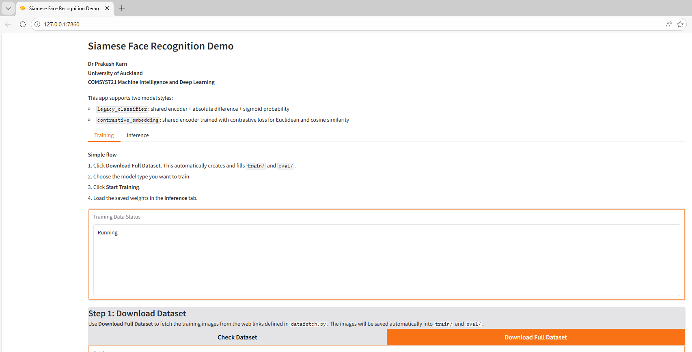
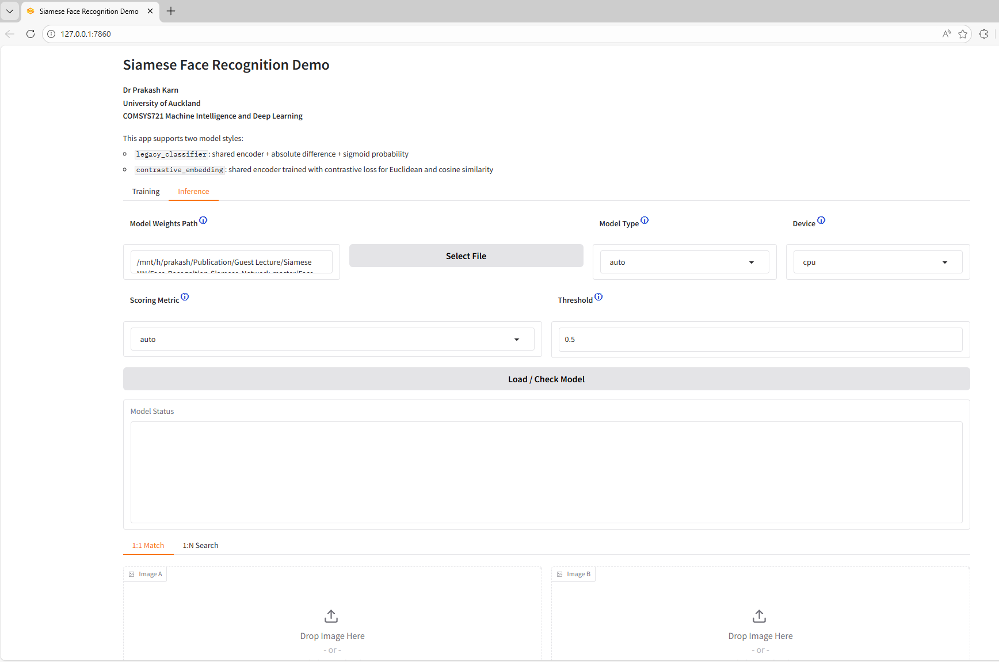
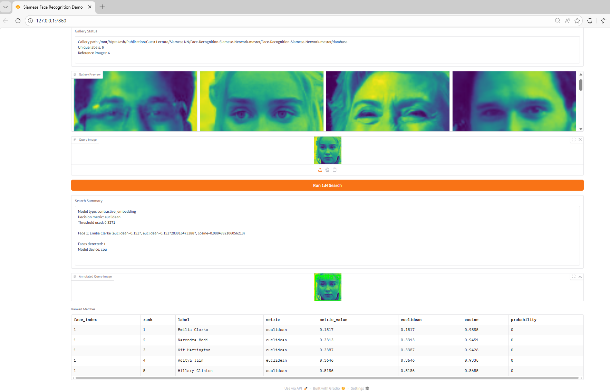

# Siamese Face Recognition Demo

Prepared By:

- Dr Prakash Karn
- University of Auckland
- COMSYS721 Machine Intelligence and Deep Learning

This is a cleaned classroom version of Siamese Face Recognition Demo.

## Shared Model Weights

Pretrained classroom checkpoints for both models, along with their JSON metadata files, are available here:

- [Download shared weights and JSON metadata](https://uoa-my.sharepoint.com/:f:/g/personal/pkar443_uoa_auckland_ac_nz/IgDyIl0jralQRqQ3WZ0Zm29AAZ1Hl3GkX_7RWBDR0ZHTR94?e=mdrPvc)

These shared checkpoints are suitable for classroom demonstration, but they are **not the optimal final result**. The models can be trained further to achieve higher validation accuracy and better `1:1` / `1:N` performance.

## What This Project Is For

This folder is a classroom demo of a Siamese neural network for face similarity.

It is used in two stages:

1. `Training`
   Download a face dataset, train a Siamese model, and save the best weights.
2. `Inference`
   Load the saved weights and compare faces either as:
   - `1:1 Match`: compare two images and decide whether they are similar
   - `1:N Search`: compare one query image against an enrolled gallery and find the best match

Two model styles are supported:

- `contrastive_embedding`
  shared encoder trained with contrastive loss; inference uses Euclidean distance or cosine similarity
- `legacy_classifier`
  shared encoder plus absolute difference and sigmoid; inference uses match probability

It now includes a local GUI with:

- a `Training` tab
- a simple `Download Full Dataset -> Train` workflow
- a `1:1 Match` inference view
- a `1:N Search` inference view
- embedding previews for `1:1` matching
- support for Euclidean distance and cosine similarity with contrastive weights
- popup folder/file selectors for key paths
- hover help icons for parameters and recommended values

## GUI Screenshots

### Training Tab



### Inference Tab



### 1:1 Match Example


### 1:N Search Example



### Contrastive Training Loss Curve


### Contrastive Training Accuracy Curve


### Contrastive Distance Histogram


### Legacy Classifier Loss Curve


### Legacy Classifier Accuracy Curve


## Normal Workflow

For most users, the intended flow is:

1. Open the GUI with `python3 src/gui.py`
2. In `Training`, click `Download Full Dataset`
3. Choose `contrastive_embedding` or `legacy_classifier`
4. Train the model and save an auto-named weights file
5. In `Inference`, load the saved weights
6. Run `1:1 Match` or `1:N Search`

## Recommended Hyperparameters

These are the recommended classroom settings for this PC and dataset. They are practical starting points, not guaranteed global optima.

### `contrastive_embedding`

- `iterations`: `2500`
- `batch_size`: `16`
- `positive_prob`: `0.5`
- `loss_every`: `50`
- `eval_every`: `100`
- `oneshot_n`: `500`
- `contrastive_margin`: `1.0`
- `embedding_dim`: `256`
- `seed`: `42`
- `device`: `cpu`

### `legacy_classifier`

- `iterations`: `1000` for the first run, then resume for another `1500` if needed
- `batch_size`: `16`
- `positive_prob`: `0.5`
- `loss_every`: `50`
- `eval_every`: `100`
- `oneshot_n`: `500`
- `seed`: `42`
- `device`: `cpu`

## Folder Contents

- `src/gui.py`: Gradio GUI
- `src/datafetch.py`: download PubFig images and create `train/` and `eval/`
- `src/train.py`: train the Siamese model and save best weights
- `src/main.py`: script-based inference
- `src/model.py`: Siamese network definition
- `src/runtime.py`: CPU/GPU selection
- `src/similarity.py`: Euclidean distance, cosine similarity, and threshold helpers
- `src/utils.py`: shared path helpers
- `database/`: small example gallery for inference
- `sample/`: sample images for testing
- `myself.jpg`: sample query image
- `haarcascade_frontalface_default.xml`: face detector used to locate and crop faces before similarity is computed

## What Each Folder Is Used For

- `train/`
  created automatically by `Download Full Dataset`; used only for training
- `eval/`
  created automatically by `Download Full Dataset`; used only for validation during training
- `database/`
  gallery of enrolled people for `1:N` inference; not used for training
- `sample/`
  example images for quick testing and classroom demo
- `src/`
  source code for fetching data, training, inference, and the GUI

If `train/` and `eval/` do not exist, the GUI will create them during dataset download.
If `database/` does not exist, `1:N` search will need a new gallery folder selected later.

## Why Haar Cascade Is Used

The Haar cascade is not the similarity model.

It is used first to detect the face region inside a normal photo so the network receives a cropped face instead of the whole image.
After that, the Siamese model compares the cropped faces.

So the inference flow is:

1. detect face with Haar cascade
2. crop and resize the face
3. pass both faces into the Siamese network
4. get a similarity score

## Environment Setup

Use Python 3.12 or a nearby 3.x version.

If the repo is on a mounted Windows drive in WSL, create the virtual environment in your Linux home directory:

```bash
python3 -m venv ~/venvs/siamese_face_demo
source ~/venvs/siamese_face_demo/bin/activate
pip install --upgrade pip
pip install -r requirements.txt
```

If you are not on a mounted drive, a normal local `.venv` is also fine.

## Important Notes

- The real model weights file is not bundled directly in this repo.
- Shared classroom checkpoints are available from the SharePoint link above.
- Current shared checkpoints are useful for demonstration, but they are not the optimal final result and can be trained further for higher accuracy.
- The training app now auto-generates checkpoint names such as `saved_best_contrastive_embedding_2500iter.weights.h5` or `saved_best_legacy_classifier_1000iter.weights.h5`.
- Training also writes a small JSON metadata file next to the weights. The GUI uses it to auto-detect model type and recommended thresholds.
- For lecture/demo reliability, prefer `--device cpu`.
- TensorFlow GPU use depends on a correct CUDA/cuDNN setup. If GPU is not detected, use CPU.
- Dataset download speed depends on old PubFig URLs. Many links are slow or dead, so latency and timeout cost matter more than image size.
- Writing many small files under `/mnt/...` in WSL is slower than writing inside native Linux storage.

## GUI Workflow

Launch the app:

```bash
python3 src/gui.py
```

What the GUI provides:

- `Training` tab
  - `Check Dataset` to show what is currently in `train/` and `eval/`
  - `Download Full Dataset` to fetch training data from the URLs in `src/datafetch.py`
  - training controls for model type, iterations, batch size, save path, and device
  - after training, the GUI shows `loss_curve.png` and `accuracy_curve.png`; contrastive runs also show a Euclidean distance histogram
  - optional advanced settings hidden by default
- `Inference` tab
  - `Load / Check Model`
  - auto-detect saved model type from metadata
  - probability, Euclidean, or cosine scoring depending on model type
  - `1:1 Match` for comparing two images
  - embedding previews for `Image A` and `Image B`
  - `1:N Search` for matching a query image against a gallery folder

Recommended classroom flow:

1. Open the GUI.
2. In `Training`, click `Download Full Dataset`. This automatically creates and fills `train/` and `eval/`.
3. In `Training`, choose `contrastive_embedding` if you want the lecture-aligned metric-learning version.
4. Train and save the auto-generated checkpoint file.
5. In `Inference`, load the saved weights.
6. Use `1:1 Match` or `1:N Search`.

## CLI Fallback

### 1. Download Training Data

```bash
python3 src/datafetch.py
```

Optional tuning:

```bash
python3 src/datafetch.py --workers 12 --timeout 2.5
```

### 2. Train the Model

```bash
python3 src/train.py \
  --model-type contrastive_embedding \
  --save-path saved_best.weights.h5 \
  --device cpu
```

The `--save-path` value is treated as the base name. The training code appends model type and iteration count automatically.

### 3. Run Inference

```bash
python3 src/main.py \
  -db database \
  -m saved_best.weights.h5 \
  -i myself.jpg sample/tbbt.jpg \
  --model-type auto \
  --metric euclidean \
  --device cpu
```

Annotated images are written to `outputs/`.

## Enrolling Your Own People

For a simple closed-set class demo:

- replace images inside `database/` with your own enrolled people
- use one image per person for a basic demo
- or create one folder per person and place multiple images inside it

Examples:

- `database/Alice.jpg`
- `database/Bob.jpg`

or

- `database/Alice/1.jpg`
- `database/Alice/2.jpg`
- `database/Bob/1.jpg`

Then use the GUI `1:N Search` tab or the CLI inference script.

## Notes

- `Quick Fetch` is not required for normal use and is not part of the main GUI flow.
- `train/` and `eval/` are for model training.
- `database/` or another gallery folder is only for `1:N` inference after the model is trained.
- `contrastive_embedding` is the lecture-aligned option for contrastive loss, Euclidean distance, cosine similarity, `1:1`, and `1:N`.
- `legacy_classifier` is kept as the original classifier-style Siamese implementation from this repository.

## License

This repository keeps the original MIT license. See `LICENSE`.
